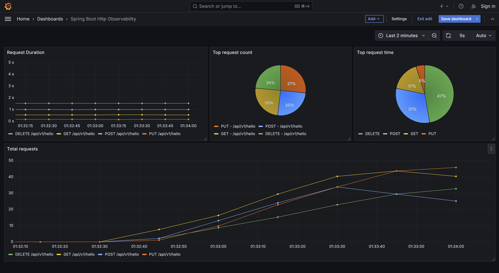

# Spring metrics with Prometheus and Grafana

The following example shows how to integrate Prometheus with Spring Boot Actuator and how to use Prometheus as a datasource for grafana.

There is a simple `/api/v1/hello` endpoint available for `GET`, `POST`, `DELETE` and `PUT` methods. Each endpoint
has its own sleep time to simulate response latency.

### How to run

Start by build the dependencies with

`make dev-dependencies` or `docker-compose up -d prometheus grafana`

Grafana should be available on `http://localhost:3000`. You should see a dashboard named "Spring Boot Http Observability Example" under "Dashboards" one the left menu.
Prometheus should be running on `http://localhost:9090`.

Then run the spring application. You can check the prometheus metrics at `http://localhost:666/actuator/prometheus`.

### Generate metrics
To generate metrics there is a `requests.sh` script in the `scripts` folders. This script will make a number of random requests to our hello endpoint (with different methods). 
You can run this script with

`make requests` or `cd scripts && chmod +x requests.sh && ./requests.sh`

After a few seconds you should be able to see stats in the grafana dashboard.